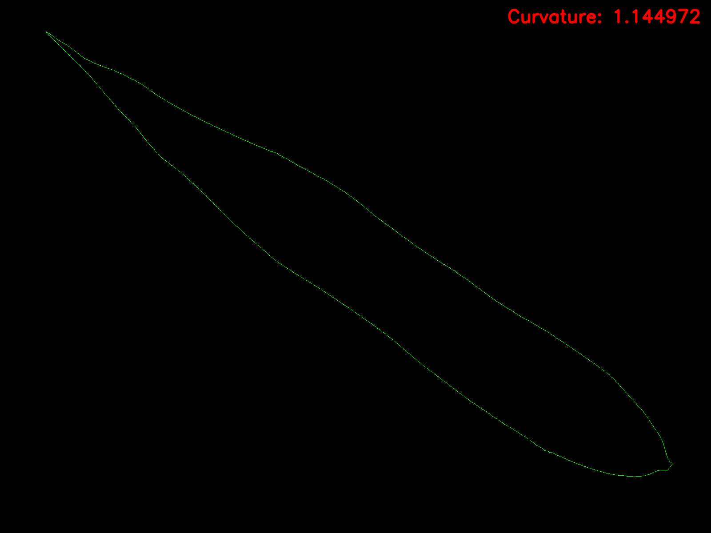

# Leaf Curvature

This repository contains a Python script for extracting a numerical curvature
feature from binary leaf masks. It processes each mask, detects the largest leaf
contour, estimates local curvature along the boundary, removes outliers, and
writes an annotated output image with the detected contour and final curvature
score.

## Example

Input binary mask:


Generated curvature output:



## What the Script Does

`get_curvature.py` performs the following steps:

1. Loads a binary leaf segmentation mask.
2. Converts the mask to a clean foreground/background representation.
3. Applies morphological closing to reduce small boundary gaps.
4. Extracts the largest external contour as the leaf boundary.
5. Computes local curvature from 5-point contour windows using a degree-4
   polynomial fit.
6. Smooths the contour with a moving average.
7. Removes curvature outliers using a mean +/- sigma standard deviation filter.
8. Computes the final curvature feature as:

```text
variance(curvature) / mean(curvature)^2
```

9. Saves an annotated image showing the detected boundary and curvature score.

## Repository Structure

```text
.
|-- get_curvature.py       # Main curvature extraction script
|-- requirements.txt       # Python dependencies
|-- input/                 # Example binary leaf masks
|-- output/                # Example annotated curvature outputs
`-- README.md
```

## Requirements

Use Python 3. Install the required packages with:

```bash
pip install -r requirements.txt
```

The main dependencies are:

- OpenCV
- NumPy
- Matplotlib
- Pillow

## Usage

### Process the default input folder

By default, the script reads images from `input/` and writes annotated results to
`output/`.

```bash
python get_curvature.py
```

### Process a single image

```bash
python get_curvature.py \
  -i input/1-with-apriltags_binary_mask.png \
  -o output
```

This creates:

```text
output/1-with-apriltags_binary_mask_curvature.png
```

### Process a custom folder

```bash
python get_curvature.py -i path/to/input_masks -o path/to/output_folder
```

### Save debug plots

Use `--plot` to save a multi-panel diagnostic plot for each image. The plot
shows the mask and curvature values before and after smoothing and outlier
removal.

```bash
python get_curvature.py -i input -o output --plot
```

### Display debug plots interactively

```bash
python get_curvature.py -i input -o output --show-plot
```

## Command-Line Options

```text
-i, --input       Input image file or folder. Default: input
-o, --output      Output folder. Default: output
--step            Curvature sampling step. Default: 5
--plot            Save diagnostic matplotlib plots.
--show-plot       Display diagnostic plots interactively.
```

## Input Format

The input should be a binary mask image where:

- nonzero pixels represent the leaf
- zero pixels represent the background

Supported image extensions are:

```text
.png, .jpg, .jpeg, .bmp, .tif, .tiff
```

## Output Format

For each input image named:

```text
<name>.<ext>
```

the script writes an annotated image named:

```text
<name>_curvature.<ext>
```

The output image contains:

- a black background
- the detected contour in green
- the final curvature score in red text

If `--plot` is enabled, an additional diagnostic image is saved as:

```text
<name>_plot.png
```

## Notes

- The script uses the largest external contour, so each mask should contain one
  main leaf object.
- The curvature score is a relative feature derived from boundary curvature
  variation. It is useful for comparing leaf shapes processed with the same
  mask preparation and parameter settings.
- The default `--step 5` follows stricter 5-point interval sampling. Smaller
  values produce denser curvature sampling.
